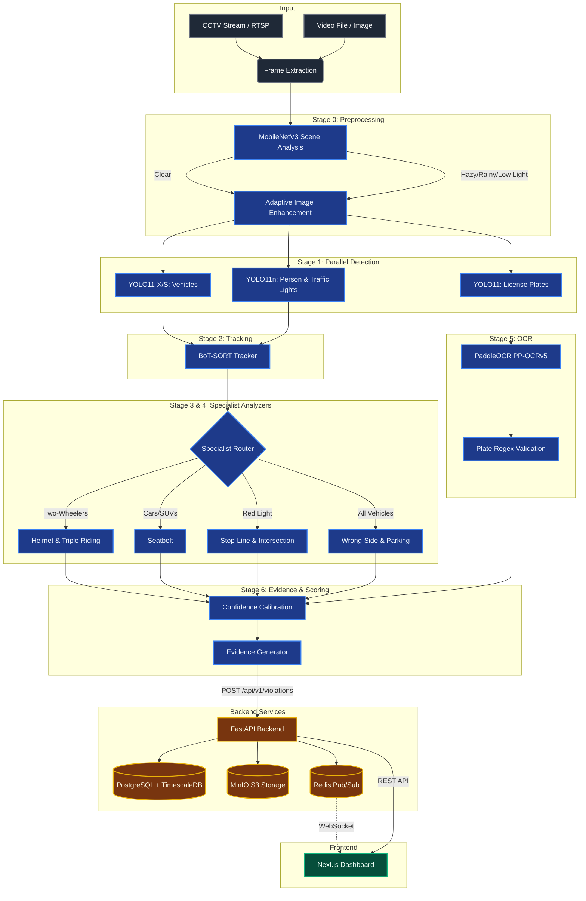

# Gridlock 2.0 — AI Traffic Violation Detection

A production-grade, AI-powered traffic violation detection system purpose-built for Bengaluru (Indian road conditions, Indian vehicles, Indian license plate formats). Built for **Flipkart Gridlock 2.0 (Phase 2)**.

This system processes CCTV feeds at 30+ FPS (GPU) or 5+ FPS (CPU), detects all 8 violation types automatically, and generates tamper-proof evidence packages.

## Features

- **Adaptive Hardware Selection:** Runs YOLO11-X on GPU (6ms) or YOLO11-S on CPU (80ms).
- **Parallel Multi-Model Architecture:** 7 specialist models working in tandem.
- **3-Tier Confidence System:** `AUTO_ENFORCE` (≥0.90), `HUMAN_REVIEW` (0.70-0.90), `LOG_ONLY` (<0.70).
- **Tamper-Proof Evidence:** Annotated image + 3s video clip + SHA-256 hash.
- **Next.js Dashboard:** Real-time violation feeds, analytics heatmap, and officer review queue.
- **Microservices:** FastAPI backend, PostgreSQL + TimescaleDB, Redis, MinIO object storage.

---

## Architecture Diagram

The system employs a 7-Stage Pipeline for end-to-end processing, routing data from CCTV feeds to the final Next.js dashboard.



---

## Developer Guide

For a full understanding of the project structure and execution strategy, refer to [`plan.md`](plan.md).

### 1. Prerequisites

Before starting, ensure you have the following installed on your machine:
- **Python 3.10+**
- **Docker & Docker Compose** (for running the full stack)
- **Git**
- **NVIDIA GPU drivers & CUDA** (optional, highly recommended for 30+ FPS processing)

### 2. Local Environment Setup

Clone the repository and set up your Python environment:

```bash
# 1. Clone the repository
git clone https://github.com/10vulture1005/grid2.0.git
cd grid2.0

# 2. Create and activate a virtual environment
python -m venv venv
source venv/bin/activate  # On Windows use: venv\Scripts\activate

# 3. Install the ML Inference requirements
pip install -r requirements.txt
```

### 3. Downloading Datasets and Models

We use external pretrained models to power the YOLO pipelines and external datasets for fine-tuning.

#### Models
```bash
# Download the UVH-26 Indian Vehicle Detection Model (IISc Bangalore)
huggingface-cli download iisc-aim/UVH-26 weights/YOLOv11-S/UVH-26-MV-YOLOv11-S.pt --local-dir data/uvh26_models

# Optional: Download specific YOLO models for seatbelt and license plate detection
# huggingface-cli download RISEF/yolov11s-seatbelt --local-dir data/seatbelt_model
# huggingface-cli download morsetechlab/yolov11-license-plate-detection --local-dir data/plate_model
```

#### Datasets
If you are fine-tuning the models (e.g. for helmet detection or triple riding), download the Traffic Violation Detection (TVD) dataset from Roboflow and extract it:

```bash
# Example for extracting the TVD YOLOv11 dataset
mkdir -p data/tvd
unzip TVD.v11i.yolov11.zip -d data/tvd/
```
*(Note: Datasets are strictly ignored in `.gitignore` due to large file sizes. Do not commit dataset images to the repository.)*

### 4. Running the Complete Stack (Docker)

To spin up the entire system (FastAPI backend, PostgreSQL database, Redis, MinIO storage, and the Next.js Frontend Dashboard):

```bash
docker-compose up --build
```

**Services will be available at:**
- **Frontend Dashboard:** `http://localhost:3000`
- **Backend API Docs:** `http://localhost:8000/docs`
- **MinIO UI (Evidence Storage):** `http://localhost:9001`
- **ML Inference Service:** `http://localhost:8001`

### 5. Running the ML Pipeline Locally (Standalone)

If you only want to test the ML pipeline inference without spinning up Docker:

```bash
# Ensure your virtual environment is active
python scripts/demo_inference.py --source path/to/your/video.mp4
```
